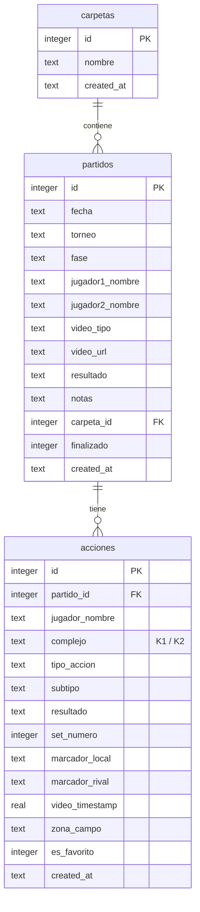

# 🏐 BVScouter — Scouting y Análisis Táctico para Vóley Playa

¡Buenas! Este es **BVScouter**, una aplicación de escritorio potente e intuitiva para el scouting y análisis táctico de partidos de vóley playa. Está desarrollada en el entorno de **Electron**, utilizando **Vite** para la compilación y **SQLite** (`better-sqlite3`) para persistir todos los datos en local.

La aplicación permite registrar cada acción del partido (saques, recepciones, colocaciones, ataques, bloqueos y defensas) en tiempo real o en diferido sobre un vídeo, generando estadísticas avanzadas, gráficos interactivos y reportes detallados listos para exportar en PDF.

---

## 🌟 Características Principales

*   **🗂️ Explorador estilo Google Drive:** Organiza todos tus partidos cómodamente en carpetas personalizadas. Puedes arrastrar y soltar partidos dentro de carpetas para mantener tu biblioteca ordenada o devolverlos a la raíz si te has equivocado.
*   **🎥 Reproductor de Vídeo Avanzado y Atajos de Teclado:** Registra las jugadas con una mano usando los atajos de teclado mientras el vídeo se reproduce. Controla la velocidad de reproducción, avanza fotograma a fotograma o ve en cámara lenta.
*   **🎬 Generador de Clips y Highlights (YouTube y Local):** Introduce un enlace de YouTube o un archivo local, y la app lo descargará automáticamente (con caché inteligente) y recortará las jugadas clave usando `ffmpeg`.
*   **🏷️ Marcador Overlay Dinámico:** Los clips de vídeo recortados se exportan con una superposición (overlay) en la esquina superior derecha que muestra el marcador del set actualizado al segundo exacto de la jugada.
*   **📊 Informes y Gráficos Interactivos:** Visualiza el rendimiento de tus jugadores mediante gráficos interactivos de **Chart.js** (porcentajes de Side-Out/FBSO, efectividad de ataque, patrones de distribución, mapas de calor por zonas y evolución del marcador punto a punto).
*   **🛡️ Defensas Neutras:** Soporte para registrar defensas de continuidad (tecla `,`), permitiendo seguir la jugada sin penalizar las medias de efectividad de defensa del jugador.
*   **📄 Exportación de Informes en PDF:** Genera informes limpios y profesionales de las estadísticas del partido para compartirlos con tu compañero o entrenador.

---

## ⚙️ Arquitectura y Pila Tecnológica

La aplicación está diseñada siguiendo el patrón de arquitectura de Electron, separando los procesos de Main y Renderer con comunicación segura a través de `preload.js` mediante IPC.

*   **Shell del Sistema:** [Electron 43](https://www.electronjs.org/)
*   **Empaquetado y Bundling:** [Vite](https://vitejs.dev/) + [Electron Forge](https://www.electronforge.io/)
*   **Base de Datos local:** [SQLite](https://www.sqlite.org/) con el driver nativo de alto rendimiento [better-sqlite3](https://github.com/WiseLibs/better-sqlite3) (activado en modo WAL y con claves foráneas habilitadas).
*   **Motor Gráfico:** [Chart.js](https://www.chartjs.org/) para la representación visual de estadísticas.
*   **Procesamiento de Vídeo:** [ffmpeg](https://ffmpeg.org/) (recorte de vídeo y composición de marcador) + [yt-dlp](https://github.com/yt-dlp/yt-dlp) (descarga inteligente de partidos desde plataformas de vídeo).

---

## 🗄️ Esquema de la Base de Datos (SQLite)

El modelo de datos se estructura en torno a tres tablas principales conectadas mediante relaciones de clave foránea. A continuación se presenta el diagrama de entidad-relación:



---

## 🎹 Atajos de Teclado del Scouting

El módulo de scouting está pensado para ser usado de forma fluida mediante atajos rápidos de teclado:

| Tecla / Combinación | Acción Realizada |
| :--- | :--- |
| `1` / `2` | Selecciona el Jugador 1 o el Jugador 2 respectivamente |
| `s` | Selecciona tipo de acción: **Saque** |
| `r` | Selecciona tipo de acción: **Recepción** |
| `c` | Selecciona tipo de acción: **Colocación** |
| `a` | Selecciona tipo de acción: **Ataque** |
| `b` | Selecciona tipo de acción: **Bloqueo** |
| `d` | Selecciona tipo de acción: **Defensa** |
| `,` | Registra una **Defensa Neutra** (dentro del tipo Defensa) |
| `Enter` | Marca la última acción como **Punto** |
| `Backspace` | Marca la última acción como **Error** |
| `z` | **Deshacer (Undo)** la última acción registrada |
| `Espacio` | Play / Pause del reproductor de vídeo |
| `ArrowLeft` / `ArrowRight` | Retroceder / Avanzar vídeo unos segundos |
| `.` | Avanzar vídeo fotograma a fotograma |
| `-` / `+` | Disminuir / Aumentar velocidad del vídeo |
| `p` | Reproducir vídeo a velocidad rápida (3x) |
| `l` | Reproducir vídeo en sentido inverso (Reverse) |
| `f` | Alternar pantalla completa del vídeo |

---

## 🛠️ Requisitos del Sistema

Para poder hacer uso de las funcionalidades de descarga de vídeos desde YouTube y el recorte automatizado de jugadas, tu sistema debe disponer de las siguientes herramientas instaladas en el `PATH`:

1.  **FFmpeg:** Requerido para manipular, recortar y concatenar los fragmentos de vídeo y componer el overlay del marcador.
2.  **yt-dlp:** Requerido para descargar los partidos de YouTube.

### Instalación en Linux (Ubuntu/Debian)
```bash
sudo apt update
sudo apt install ffmpeg yt-dlp
```

---

## 💻 Guía de Inicio para Desarrollo

Sigue estos sencillos pasos para levantar el entorno local de desarrollo:

### 1. Clonar el repositorio
```bash
git clone https://github.com/tu-usuario/BVScouter.git
cd BVScouter
```

### 2. Instalar dependencias de Node.js
Asegúrate de tener instalado Node.js (se recomienda v18 o superior):
```bash
npm install
```

### 3. Iniciar la aplicación en modo desarrollo
Arranca Electron con soporte para recarga en caliente (Hot Module Replacement - HMR) para el renderer:
```bash
npm start
```

---

## 📦 Compilación y Distribución

Si deseas generar el paquete instalador optimizado para producción en tu sistema local:

### Crear el ejecutable / instalador (ej. `.deb` para Linux)
```bash
npm run make
```

El instalador compilado se ubicará en la carpeta autogenerada `out/make/`. Para realizar la instalación en sistemas Debian/Ubuntu, puedes ejecutar:
```bash
sudo dpkg -i out/make/deb/x64/bvscouter_1.1.0_amd64.deb
```

---

## 🚀 Próximas Mejoras (Roadmap)

Basado en las revisiones del sistema y las necesidades de uso en pista, el plan de desarrollo contempla las siguientes mejoras prioritarias:

*   [ ] **Corrección del flujo de marcadores:** Garantizar que al deshacer (`z`) una acción que otorgaba punto, se descuente correctamente del marcador.
*   [ ] **Evitar jugadores duplicados:** Implementar verificación de existencia por nombre antes de crear nuevos registros en los partidos.
*   [ ] **Modularización de `scouting.js`:** Separar el archivo de scouting (actualmente de gran tamaño) en módulos dedicados para simplificar el mantenimiento.
*   [ ] **Gestión de memoria:** Implementar el hook de desmontaje `destroy()` en el enrutador para limpiar los Charts de Chart.js y evitar fugas de memoria (memory leaks).
*   [ ] **Control de velocidad en UI:** Añadir controles visuales para la velocidad del vídeo además de los atajos de teclado.
*   [ ] **Exportación limpia a PDF:** Mejorar el módulo de PDF para generar un dossier estéticamente impecable con gráficos y tablas de resumen.

---

## 📝 Licencia y Autor

*   **Autor:** Darío Erades — [dario@erades.es](mailto:dario@erades.es)
*   **Licencia:** Este proyecto se distribuye bajo la licencia **MIT**. Consulta el archivo `LICENSE` para más información.
